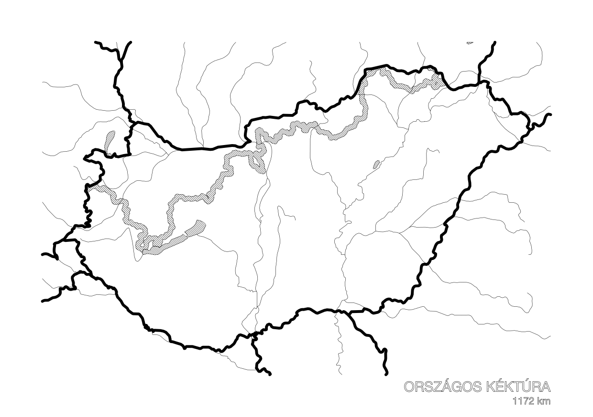

# GPX Tracks to Physical Medium

Generate fabrication-ready SVGs from GPX tracks and openly available map data for pen plotters and laser cutters.

## Hungarian Blue Trail

A5 landscape (210x148mm) notebook cover featuring Hungary's border, water features, and the OKT ([Országos Kéktúra](https://en.wikipedia.org/wiki/National_Blue_Trail)) hiking trail.



### Setup

```bash
pip install -r hungarian-blue-trail/requirements.txt
```

### Generate

```bash
python3 hungarian-blue-trail/generate_cover.py
```

### Output

Two vendor-ready SVGs are written to `hungarian-blue-trail/output/`:

| File | Purpose | Layers |
|------|---------|--------|
| `plotter_210x148mm.svg` | Pen plotter (AxiDraw) | `1-borders` (1.0mm), `2-water` (0.1mm), `3-trail` (0.1mm) |
| `laser_210x148mm.svg` | Laser cutter | `Engrave` (black fill), `Cut` (red hairline, 1.5mm slit) |

Both files use Inkscape-compatible SVG layers (`inkscape:groupmode="layer"`).

### Data Sources

- Country borders and water features: [Natural Earth](https://www.naturalearthdata.com/) 10m vectors (auto-downloaded and cached)
- Trail: GPX track in `hungarian-blue-trail/input/`
