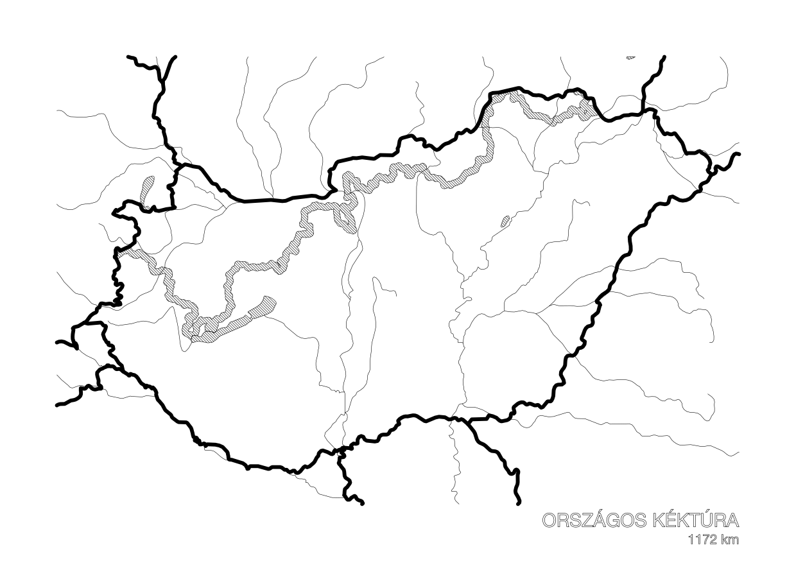

# Hungarian Blue Trail

A5 landscape (210×148mm) notebook covers showing Hungary's border, water features, and a hiking trail. The trail is rendered as a see-through slit in the laser version, so the colour of the page underneath shows through.

Two trail editions are included:

| Edition | Trail | Distance | GPX |
|---------|-------|----------|-----|
| OKT | Országos Kéktúra | 1172 km | `input/okt_teljes_20260130.gpx` |
| OKK | Országos Kékkör | 2550 km | `input/okk_teljes.gpx` |



## Setup

```bash
pip install -r requirements.txt
```

Dependencies: svgwrite, shapely, pyproj, gpxpy, cairocffi, cairosvg, requests.

## Generate

Run from the **repo root**. Geographic data (Natural Earth 10m vectors) is downloaded on first run and cached in `.cache/`.

### OKT — Országos Kéktúra (default)

```bash
python3 hungarian-blue-trail/generate_cover.py
```

### OKK — Országos Kékkör

```bash
python3 hungarian-blue-trail/generate_cover.py \
  --gpx hungarian-blue-trail/input/okk_teljes.gpx \
  --output hungarian-blue-trail/output-okk \
  --title "ORSZÁGOS KÉKKÖR" \
  --subtitle "2550 km"
```

### All options

```
--gpx PATH          Input GPX file (default: OKT gpx)
--output DIR        Output directory (default: hungarian-blue-trail/output)
--title TEXT        Caption title (default: ORSZÁGOS KÉKTÚRA)
--subtitle TEXT     Caption subtitle (default: 1172 km)
--country NAME      Natural Earth country name (default: Hungary)
--page-width MM     Page width in mm (default: 210)
--page-height MM    Page height in mm (default: 148)
--cache DIR         Geodata cache directory (default: .cache)
--no-plotter        Skip plotter SVG output
--no-laser          Skip laser SVG output
```

Example — A4 landscape, laser only:

```bash
python3 hungarian-blue-trail/generate_cover.py \
  --page-width 297 --page-height 210 \
  --output hungarian-blue-trail/output-a4 \
  --no-plotter
```

## Output

Three files are written per run:

```
<output>/
  plotter_210x148mm.svg  # pen plotter
  laser_210x148mm.svg    # laser cutter
  preview.png            # raster preview (plotter SVG at 150 DPI)
```

File names reflect the page dimensions, so different page sizes don't overwrite each other.

### Plotter SVG

Single multi-layer SVG with AxiDraw-compatible layer names (number-prefixed so they sort correctly):

| Layer | Content | Pen width |
|-------|---------|-----------|
| `1-borders` | Country borders (Hungary + neighbors, clipped to page) | 1.0 mm |
| `2-water` | Rivers + hatched lakes | 0.1 mm |
| `3-trail` | Trail, hatched to 1.5 mm width | 0.1 mm |
| `4-text` | Caption title + subtitle, outlined paths | 0.1 mm |

### Laser SVG

Single multi-layer SVG, colour-coded for a typical laser workflow (red = vector cut, black = raster engrave):

| Layer | Type | Content |
|-------|------|---------|
| `1-Trail` | Cut (red hairline) | See-through GPX track slit, 1.5 mm wide |
| `2-Contour` | Cut (red hairline) | Outer 210×148 mm rectangle |
| `3-Stitch` | Cut (red hairline) | 5 × 1 mm holes along the spine for bookbinding |
| `4-Engrave` | Engrave (black fill) | Borders + water + caption text |

## How it works

1. Hungary's border and neighbors are extracted from Natural Earth 10m country polygons
2. Rivers and lakes are pulled from Natural Earth water datasets; orphan rivers not connected to Hungary are filtered out
3. The trail is parsed from a GPX file — each GPX segment is kept separate so discontinuous sub-trails don't get bridged with straight lines
4. Everything is projected (WGS84 → Web Mercator) and fitted to the page using a shared `CoordTransformer`
5. For the laser version, the trail slit is clipped to the inner edge of the border and lakes are subtracted so it doesn't cut through water features
6. Text is converted to outlined `<path>` elements via cairocffi (no font dependencies at fabrication time)

All layers share the same coordinate transform, so they align when overlaid.
